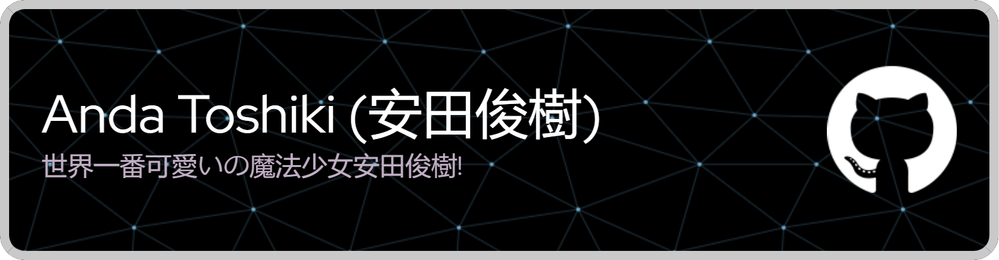

<!-- # Anda Toshiki (安田俊樹) -->



# 👋 ようこそ、Developers!


> Hey there, I'm Anda Toshiki, or you could refer me as _kiki_ in short (the same name as the protagonist Majo from [Kiki's Delivery Service](https://en.wikipedia.org/wiki/Kiki%27s_Delivery_Service) by Hayao Miyazaki); I'm the Maho ShouJo (魔法少女) whom watches anime, drinks monster, writes codes, documents tutorials, takes photos, eats burgers and stays up all nights~

Introduction once more, my name is Anda Toshiki, pronounced as `AHN-dah TOH-shee-kee` in case you find my name obscure to read out. I'm currently a precollege student with offer of admission from [UB (University at Buffalo)](https://www.buffalo.edu) as a transfer student to [(CIT) California Institute of Technology](https://www.caltech.edu). I am also the founder of [Toshiki Dev](https://github.com/toshikidev) as the first _organizational_ community I have ever created for building functional utility components and webapps/software to my own needs as serving solutions to people having the same requests, additionally I am maintaining the community with both of my cat 😺 (玉ちゃん & 桃ちゃん both of them are [cute girls](https://www.youtube.com/shorts/FT9FOI-yJP4)!)

- **🤷‍♀️ Pronouns**: **She/her** (internet wide, I'm a loli :P); **he/him** if you happens to meet me offline, **they/them** additionally.

- **👌 Languages**: I was raised in a trilingual family since born thus I speak three languages, **English** primarily, proficient in **Chinese** and fluent in **Japanese**, all three languages are welcomed to use when having conversations with me, I also don't mind blending all three languages together as a way to improve my long-lost Japanese language grammar!

  I'm presently learning Spanish as one of the second-most widely spoken language in the world to fit the demands of writing _espanol_ oriented documentation for better i18n experiences on my projects.

- **🎓 Academics**: I current studying Data Science and Physics as core essentials for my academia. Frontend developing and Computer Networking are both my hobbies at rest while I mostly work with numbers and maths mainly. I am also obsessed with _process automation_, _CI/CD_, I am highly active on building practical GitHub actions for easing my DevOps life.

- **👩‍💻 Frontend development & blogging**: Aside from academic learnings, I am also captivated into frontend development and blogging, more specifically theming and beautification. I was introduced to [HUGO](https://github.com/gohugoio/hugo) when I first get started with website generator/blog building, I contributes one of the best hugo theme communities-[Fixit](https://github.com/hugo-fixit/FixIt) on GitHub. I have also independently created other themes such as gallery and showcasing sites (see more in the projects table below)...

- **📃 Documenting**: I have a strong eagerness on finding the best solution for issues I encounters and devote to understand hard concepts; in order to respond to this fetish, I enjoys documenting notes and epiphanies in detailed and specific no matter how much time it waste, it deserves my dedication (see my notes [in action](https://note.toshiki.dev)).

- **🎨 Art**: I engage in pixel art and indie game developments when free, I practice techniques and share my artworks on [Discord Pixel Art](https://discord.gg/pixelart) community.

- **🎭 Anime**: I am a heavy _weeb_ whom watches anime a lot at my leisure, my favorite anime so far is, ["DanMachi" (ダンジョンに出会いを求めるのは間違っているだろうか)](https://danmachi.fandom.com/wiki/DanMachi_Wiki).

- **💾 Collectomania**: I love collecting resources from different field, from photography sets to reference books to torrents to movies et cetera. (But I usually read through any of them instead just let them sit in my hard drives).

- **📸 Photography & photo editing**: I have intermediate experience with photography editing with both PhotoShop and Illustrator and have been using both tools on daily bases to commit minor edits on photos to level of perfections; I am also interested in photography, I records everything aesthetic in life with cameras and showcase them at my [web gallery](https://gallery.toshiki.dev).

In order to prove my real identity as a human being, I have verified my identity with a GPG public key hosted on [Keybase - Anda Toshiki (@toshikidev)](https://keybase.io/toshikidev) with [ownership of domain `www.toshiki.dev`](https://keybase.io/toshikidev/sigchain#7a41ec772fd948db46e454c55efc71005299fe7b3ed76b789bbcdb5a7505667c0f) via https; which validates I am legitimately a **cute, living human loli** on Earth, you can pull and import my GPG public keys onto your local machine with the following command using cURL.

```sh
curl https://keybase.io/toshikidev/pgp_keys.asc | gpg --import #🔑
```

<table width="960px">
<tr>
<td valign="top" width="50%">

#### [Wakatime](https://wakatime.com) development breakdown

<!--START_SECTION:waka2readme-->

```text
Markdown     2 hrs 40 mins   ██████▒░░░░░░░░░░░░░░░░░░   25.89 %
TypeScript   2 hrs 28 mins   ██████░░░░░░░░░░░░░░░░░░░   23.95 %
JavaScript   1 hr 22 mins    ███▒░░░░░░░░░░░░░░░░░░░░░   13.27 %
Vue.js       1 hr 7 mins     ██▓░░░░░░░░░░░░░░░░░░░░░░   10.93 %
JSON         54 mins         ██▒░░░░░░░░░░░░░░░░░░░░░░   08.75 %
Other        28 mins         █░░░░░░░░░░░░░░░░░░░░░░░░   04.56 %
```

<!--END_SECTION_:waka2readme_-->

</td>
<td valign="top" width="50%">

#### <a href="https://blog-next.toshiki.dev" target="_blank">Blog RSS updates</a>

<!-- blog_plugin_start -->

- <a href='https://www.nexxel.dev/blog/ricing-macos/' target='_blank'>Ricing MacOS</a> - 2023-11-01
- <a href='https://www.nexxel.dev/blog/organising-life/' target='_blank'>How I Organise My Life</a> - 2023-08-03
- <a href='https://www.nexxel.dev/blog/neovim-to-vscode/' target='_blank'>Why I Switched From Neovim To VSCode</a> - 2023-06-23
- <a href='https://www.nexxel.dev/blog/new-mac/' target='_blank'>Everything I Installed on My New Mac</a> - 2023-06-02
- <a href='https://www.nexxel.dev/blog/rust/' target='_blank'>Rust: Not Just Zoom Zoom Fast</a> - 2023-02-25

<!-- blog_plugin_end -->

</td>
</tr>
<tr>
<td valign="top" width="50%">

#### GitHub activity metrics


<!--RECENT_ACTIVITY:start-->

1. 🗣 Commented on [#1185](https://github.com/andatoshiki/toshiki-status/issues/1185) in [andatoshiki/toshiki-status](https://github.com/andatoshiki/toshiki-status)
<!--RECENT_ACTIVITY:end-->

</td>
<td valign="top" width="50%">

#### <a href="https://twitter.com/andatoshiki" target="_blank">Twitter updates</a>

<!-- twitter_plugin_start -->

- <a href='https://twitter.com/andatoshiki/status/1752451770604007475' target='_blank'>Handsome for the only once in a while that will never be diverted later in the far future.</a> - 2024-01-30
- <a href='https://twitter.com/andatoshiki/status/1750886318887104727' target='_blank'>Re @shitpost_2077 @TweetHelperBot download this</a> - 2024-01-26
- <a href='https://twitter.com/andatoshiki/status/1750819533718474783' target='_blank'>Re @Darkteshoud @Tenzalt @tweethelperbot download this</a> - 2024-01-26
- <a href='https://twitter.com/andatoshiki/status/1750803241456316910' target='_blank'>Re @weirddalle @TweetHelperBot download this</a> - 2024-01-26
- <a href='https://twitter.com/andatoshiki/status/1747806334618325116' target='_blank'>The season of Quattro had ultimately came upon the arrival of my Audi A6 delivery. #audi #german #firstcar #freshman #asu2024 #audia6</a> - 2024-01-18

<!-- twitter_plugin_end -->

</td>
</tr>

</table>

### 5: Technologies

#### 5.1: Tools

          

#### 5.2: Platforms

           

#### 5.3: Languages

                            
   

#### 5.4: IDEs

 
   

#### 5.5: OS

    

<!-- ### 9. Hardwares -->

<!-- <p align="center">
    </img>
</p>

<p align="center">
    </img>
</p> -->

<p align="center">
    
</p>

<!-- footer sine wave svg centered starts-->
<!--  -->
<!-- footer sine wave ends -->
